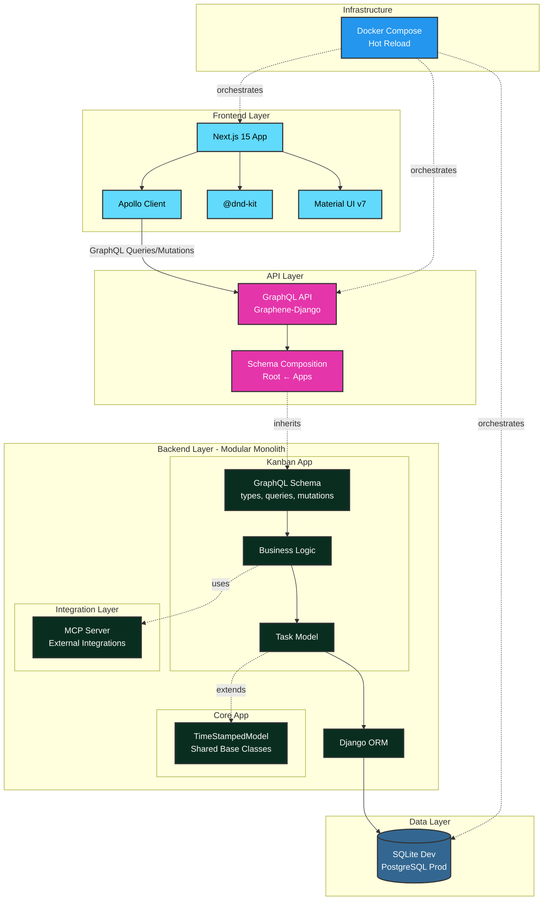

# Kanban Board - Next.js + Django GraphQL

A full-stack kanban board built with Next.js 15, Django 4.2, and GraphQL. Features drag-and-drop task management and MCP server integration.

**Tech Stack:** TypeScript, Material UI, Apollo Client, Graphene-Django, Docker

## Table of Contents

1. [Quick Start](#1-quick-start)
   - [Docker (Recommended)](#docker-recommended)
   - [Local Development](#local-development)
2. [Features](#2-features)
3. [Tech Stack](#3-tech-stack)
4. [Project Structure](#4-project-structure)
5. [Testing](#5-testing)
6. [Pre-commit Hooks](#6-pre-commit-hooks)
7. [Continuous Integration](#7-continuous-integration)
8. [Development Commands](#8-development-commands)
   - [Makefile Shortcuts](#makefile-shortcuts)
   - [GraphQL Operations](#graphql-operations)
9. [🚀 Deployment Roadmap](#9--deployment-roadmap)
10. [Architecture](#10-architecture)
    - [System Architecture](#system-architecture)
    - [Backend: Modular Monolith](#backend-modular-monolith)
    - [Frontend: Component Design](#frontend-component-design)
11. [MCP Server Integration](#11-mcp-server-integration)
    - [Local Setup](#local-setup)
12. [License](#12-license)

## 1. Quick Start

### Docker (Recommended)

```bash
# Start everything
docker-compose up --build

# Or use Makefile shortcuts
make up              # Start services
make logs            # View logs
make test            # Run all tests
make down            # Stop services
```

**Access:**
- Frontend: http://localhost:3000
- GraphQL API: http://localhost:8000/graphql

### Local Development

**Backend:**
```bash
cd backend
pip install -r requirements.txt
python manage.py migrate
python manage.py runserver
```

**Frontend:**
```bash
cd frontend
npm install
npm run dev
```

## 2. Features

- Full CRUD operations (Create, Read, Update, Delete)
- Drag-and-drop between columns (TODO → DOING → WAITING → DONE)
- **Priority system** (P1-P4): Do First, Schedule, Quick Win, Backlog
- **Category tagging** with '#' prefix (e.g., #work, #personal)
- Tasks auto-sorted by priority within columns
- GraphQL API with type-safe schema
- Real-time updates with Apollo Client
- Material UI responsive design with priority badges
- TypeScript end-to-end
- Docker hot-reload for both services
- Pre-commit hooks (Ruff, ESLint, Prettier)
- Test coverage for critical paths

## 3. Tech Stack

**Backend:**
- Django 4.2 + Graphene-Django
- GraphQL with split schema pattern
- SQLite (dev) / PostgreSQL (production)

**Frontend:**
- Next.js 15 (App Router)
- TypeScript + Apollo Client
- Material UI v7
- @dnd-kit for drag-and-drop

**Infrastructure:**
- Docker Compose with health checks
- Pre-commit hooks (Ruff + ESLint + Prettier)
- Hot reload for development
- Multi-stage builds for production

## 4. Project Structure

```
.
├── backend/                         # Django backend (modular monolith)
│   ├── apps/                       # Django apps (OpenHEXA pattern)
│   │   ├── core/                   # Shared base models and utilities
│   │   │   ├── models.py           # TimeStampedModel (DRY principle)
│   │   │   └── apps.py             # Core app configuration
│   │   └── kanban/                 # Kanban feature app
│   │       ├── models.py           # Task model (inherits TimeStampedModel)
│   │       ├── apps.py             # Kanban app configuration
│   │       ├── schema/             # GraphQL split by concern
│   │       │   ├── types.py        # TaskType, TaskStatusEnum, TaskPriorityEnum
│   │       │   ├── queries.py      # Query resolvers (allTasks)
│   │       │   └── mutations.py    # Mutation resolvers (CRUD with priority/category)
│   │       ├── graphql/            # Exported GraphQL schema
│   │       │   └── schema.graphql  # For frontend consumption
│   │       ├── tests/              # App-specific tests
│   │       │   ├── test_models.py  # Model validation tests
│   │       │   └── test_schema.py  # GraphQL API tests
│   │       ├── management/         # Django management commands
│   │       │   └── commands/
│   │       │       └── seed_tasks.py  # Sample data generator
│   │       └── migrations/         # Database migrations
│   ├── config/                     # Django configuration
│   │   ├── settings.py             # Single settings file
│   │   ├── urls.py                 # URL routing
│   │   └── schema.py               # Root GraphQL schema (composition)
│   ├── integrations/               # External service integrations
│   │   └── mcp/                    # Model Context Protocol server
│   │       ├── server.py           # FastMCP implementation
│   │       ├── fastmcp.json        # Server configuration
│   │       ├── mcp_config.example.json  # Claude Desktop config template
│   │       └── README.md           # MCP setup instructions
│   ├── scripts/                    # Utility scripts
│   │   ├── export_schema.py        # GraphQL schema export
│   │   └── README.md               # Scripts documentation
│   ├── tests/                      # Project-wide integration tests
│   │   ├── integration/
│   │   │   └── test_mcp_server.py  # MCP server async tests
│   │   └── conftest.py             # Pytest configuration
│   ├── data/                       # SQLite database directory
│   │   └── db.sqlite3
│   ├── requirements.txt            # Python dependencies
│   ├── Dockerfile                  # Multi-stage Docker build
│   └── manage.py                   # Django management script
│
├── frontend/                       # Next.js frontend
│   ├── src/
│   │   ├── app/                    # Next.js App Router
│   │   │   ├── layout.tsx          # Root layout
│   │   │   ├── page.tsx            # Home page (redirects to /tasks)
│   │   │   ├── providers.tsx       # App providers (Theme, Apollo)
│   │   │   └── tasks/
│   │   │       └── page.tsx        # Kanban board page
│   │   ├── components/             # React components
│   │   │   ├── Board.tsx           # Main board orchestrator
│   │   │   ├── ApolloWrapper.tsx   # Apollo Client provider
│   │   │   └── kanban/             # Kanban-specific components
│   │   │       ├── types.ts        # TypeScript types (TaskStatus, TaskPriority)
│   │   │       ├── TaskCard.tsx    # Draggable task card with priority badge
│   │   │       ├── KanbanColumn.tsx  # Column with drop zone + sorting
│   │   │       ├── TaskDialog.tsx  # Create/edit dialog with priority/category
│   │   │       └── useTaskDialog.ts  # Dialog state hook
│   │   ├── graphql/                # GraphQL operations
│   │   │   ├── client.ts           # Apollo Client config
│   │   │   ├── queries.ts          # GET_TASKS query
│   │   │   └── mutations.ts        # CREATE/UPDATE/DELETE mutations
│   │   ├── theme/                  # Material UI theme
│   │   │   └── theme.ts            # Custom theme configuration
│   │   └── __tests__/              # Frontend tests
│   ├── package.json                # Node dependencies
│   ├── next.config.ts              # Next.js configuration
│   ├── Dockerfile                  # Multi-stage Docker build
│   └── tsconfig.json               # TypeScript configuration
│
├── docker-compose.yml              # Services orchestration
├── Makefile                        # Development shortcuts
├── .pre-commit-config.yaml         # Code quality hooks (Ruff, ESLint)
└── .env                            # Environment variables (ports, URLs)
```

## 5. Testing

```bash
# All tests
make test

# Backend only (Django) - Run in Docker
docker-compose exec backend python manage.py test apps.kanban.tests

# Or run all backend tests including integration
docker-compose exec backend python manage.py test

# Frontend only (Jest)
cd frontend
npm test
```

**Test Coverage:**
- Backend: 20 tests (models + GraphQL API)
  - `apps/kanban/tests/test_models.py` - Task model validation
  - `apps/kanban/tests/test_schema.py` - GraphQL API operations
  - `tests/integration/test_mcp_server.py` - MCP server async functions
- Frontend: 12 tests (components + integration)
- Focus: Critical paths + enum validation + async wrappers

## 6. Pre-commit Hooks

Install and use code quality hooks:

```bash
# Install
pip install pre-commit
pre-commit install

# Run manually
pre-commit run --all-files

# Bypass for emergency
git commit --no-verify
```

**What's checked:**
- Python: Ruff (linting + formatting)
- TypeScript: ESLint + Prettier + type checking
- General: Trailing whitespace, YAML validation, large files

## 7. Continuous Integration

GitHub Actions runs automated checks on push and pull requests:

- Backend Linting: Ruff (code quality + formatting)
- Frontend Linting: ESLint + TypeScript type checking
- Backend Tests: Django test suite (20 tests)
- Frontend Tests: Jest test suite (12 tests)
- Docker Builds: Multi-stage build validation

All 5 jobs run in parallel with pip, npm, and Docker layer caching.

## 8. Development Commands

### Makefile Shortcuts

```bash
make up              # Start services
make down            # Stop services
make test            # Run all tests
make migrate         # Run migrations
make clean           # Remove containers/volumes
make logs            # View logs
make shell           # Django shell
make lint            # Lint and format code
make hooks-install   # Install pre-commit hooks
```

### GraphQL Operations

```graphql
# Query tasks with priority and category
query { allTasks { id title status priority category createdAt } }

# Create task with priority and category
mutation {
  createTask(
    title: "New Task"
    status: TODO
    priority: P1
    category: "#work"
  ) {
    task { id title priority category }
  }
}

# Update task (drag-and-drop or edit)
mutation {
  updateTask(
    id: "1"
    status: DOING
    priority: P2
  ) {
    task { id status priority }
  }
}

# Delete task
mutation { deleteTask(id: "1") { success } }
```

## 9. 🚀 Deployment Roadmap

### Current Status
✅ Fully functional local development with Docker Compose
⏳ Production deployment (roadmap below)

### Recommended Architecture (100% Free Tier)

**Phase 1: Single-User Deployment**
- **Frontend**: [Vercel](https://vercel.com) - Zero-config Next.js deployment
- **Backend**: [Render.com](https://render.com) - Free tier Django hosting (sleeps after 15min inactivity)
- **Database**: [Supabase](https://supabase.com) - Free PostgreSQL (500MB, built-in auth for future)

**Phase 2: Multi-User (Future)**
- Add Supabase Auth for user authentication
- Update Task model with user relationships
- Deploy MCP server for Claude Code mobile integration

### Key Changes Needed for Production

1. **Database Migration**: SQLite → PostgreSQL
   - Install: `psycopg2-binary`, `dj-database-url`
   - Update `settings.py` to use `DATABASE_URL` environment variable

2. **Backend Configuration**:
   - Replace `runserver` with Gunicorn in Dockerfile
   - Add production dependencies: `whitenoise`, `gunicorn`
   - Configure CORS for Vercel domain

3. **Environment Variables**:
   - `DJANGO_SECRET_KEY` (generate new for production)
   - `DATABASE_URL` (from Supabase)
   - `ALLOWED_HOSTS` (Render domain)
   - `CORS_ALLOWED_ORIGINS` (Vercel domain)
   - `NEXT_PUBLIC_GRAPHQL_URL` (Render API endpoint)

### Cost Analysis
- **Current free tier**: Sufficient for personal use (thousands of tasks)
- **Limitation**: Backend cold starts after 15min inactivity (~30-60s)
- **Upgrade path**: $7/month for no-sleep backend

### Alternative: DigitalOcean Droplet
For full control and no cold starts, deploy both services on a $6/month droplet with Docker Compose. Requires manual setup (Nginx, SSL, monitoring).

## 10. Architecture

### System Architecture



### Backend: Modular Monolith

- Feature-based apps (`apps/kanban/`, `apps/core/`) with clear boundaries
- Split GraphQL schemas (separate files for types, queries, mutations)
- Shared base models (`apps/core/models.py`) to reduce duplication
- External integrations isolated in `integrations/` directory
- Schema composition pattern in `config/schema.py`

### Frontend: Component Design

- Single-purpose components with clear responsibilities
- Custom hooks for reusable state management (`useTaskDialog`)
- TypeScript enums for type safety (`TaskStatus`)
- Organized directory structure (graphql, theme, components)

## 11. MCP Server Integration

[Model Context Protocol](https://modelcontextprotocol.io/) server for managing tasks through Claude AI using natural language.

**Implementation:**

- `@sync_to_async` wrappers bridge Django ORM with MCP's async protocol
- Supports stdio (local) and HTTP/SSE (remote) transport
- Type hints auto-generate JSON schemas
- Isolated in `integrations/mcp/` directory

### Local Setup

```bash
# 1. Install dependencies
cd backend && python3.12 -m venv venv && source venv/bin/activate
pip install -r requirements.txt

# 2. Configure Claude Desktop (~/Library/Application Support/Claude/claude_desktop_config.json)
{
  "mcpServers": {
    "kanban": {
      "command": "/FULL/PATH/TO/backend/venv/bin/python",
      "args": ["/FULL/PATH/TO/backend/integrations/mcp/server.py"],
      "env": {"DJANGO_SETTINGS_MODULE": "config.settings"}
    }
  }
}

# 3. Restart Claude Desktop and try: "Show me all TODO tasks"
```

**Available commands**: list tasks, create task, update status, delete task

> **Deployment**: Supports Railway/Render with HTTP/SSE transport. See `backend/integrations/mcp/README.md` for details.

## 12. License

MIT License - See LICENSE file for details

---

**Built with:** Next.js 15, Django 4.2, GraphQL, TypeScript, Docker
