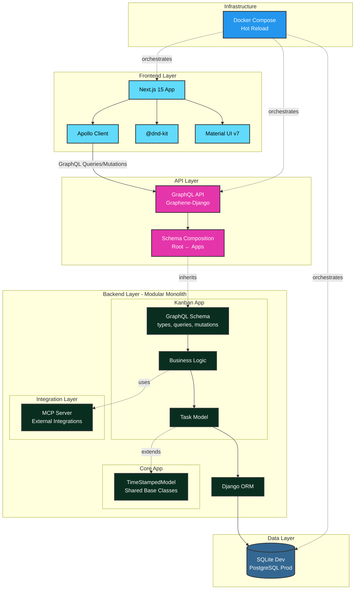

# Kanban Board

Full-stack task management application with GraphQL API and drag-and-drop interface.

**Stack:** Next.js 15, Django 4.2, TypeScript, Material UI, Apollo Client, Graphene-Django

## Table of Contents

1. [Quick Start](#1-quick-start)
   - [Docker (Recommended)](#docker-recommended)
   - [Local Development](#local-development)
2. [Features](#2-features)
3. [Tech Stack](#3-tech-stack)
4. [Project Structure](#4-project-structure)
5. [Testing](#5-testing)
6. [Pre-commit Hooks](#6-pre-commit-hooks)
7. [Continuous Integration](#7-continuous-integration)
8. [Development Commands](#8-development-commands)
   - [Makefile Shortcuts](#makefile-shortcuts)
   - [GraphQL Operations](#graphql-operations)
9. [🚀 Deployment Roadmap](#9--deployment-roadmap)
10. [Architecture](#10-architecture)
    - [System Architecture](#system-architecture)
    - [Backend: Modular Monolith](#backend-modular-monolith)
    - [Frontend: Component Design](#frontend-component-design)
11. [MCP Server Integration](#11-mcp-server-integration)
    - [Local Setup](#local-setup)
12. [License](#12-license)

## 1. Quick Start

```bash
# With Docker
docker-compose up --build

# Or separately
cd backend && pip install -r requirements.txt && python manage.py migrate && python manage.py runserver
cd frontend && npm install && npm run dev
```

- Frontend: http://localhost:3000
- GraphQL API: http://localhost:8000/graphql

## 2. Features

**Task Management:**
- Dual view modes: Kanban board + Eisenhower Matrix
- Priority system (P1-P4): Do First → Schedule → Quick Win → Backlog
- Status workflow: TODO → DOING → WAITING → DONE
- Category tagging with # prefix (#frontend, #backend, etc.)
- Drag-and-drop between columns and priority quadrants

**Filtering & Search:**
- Filter by priority (P1-P4) in both views
- Filter by status (To Do, Doing, Waiting, Done) in both views
- Filter by category with multi-select
- Full-text search across title, description, and category

**Technical Stack:**
- GraphQL API with type-safe Apollo Client
- TypeScript end-to-end with Material UI
- Docker development environment with hot-reload
- Pre-commit hooks (Ruff, ESLint, Prettier)
- MCP server for Claude AI integration

## 3. Tech Stack

**Backend:** Django 4.2, Graphene-Django, SQLite  
**Frontend:** Next.js 15, TypeScript, Apollo Client, Material UI v7, @dnd-kit  
**Infrastructure:** Docker Compose, pre-commit hooks (Ruff, ESLint, Prettier)

## 4. Project Structure

```
.
├── backend/                         # Django backend (modular monolith)
│   ├── apps/                       # Django apps (OpenHEXA pattern)
│   │   ├── core/                   # Shared base models and utilities
│   │   │   ├── models.py           # TimeStampedModel (DRY principle)
│   │   │   └── apps.py             # Core app configuration
│   │   └── kanban/                 # Kanban feature app
│   │       ├── models.py           # Task model (inherits TimeStampedModel)
│   │       ├── apps.py             # Kanban app configuration
│   │       ├── schema/             # GraphQL split by concern
│   │       │   ├── types.py        # TaskType, TaskStatusEnum, TaskPriorityEnum
│   │       │   ├── queries.py      # Query resolvers (allTasks)
│   │       │   └── mutations.py    # Mutation resolvers (CRUD with priority/category)
│   │       ├── graphql/            # Exported GraphQL schema
│   │       │   └── schema.graphql  # For frontend consumption
│   │       ├── tests/              # App-specific tests
│   │       │   ├── test_models.py  # Model validation tests
│   │       │   └── test_schema.py  # GraphQL API tests
│   │       ├── management/         # Django management commands
│   │       │   └── commands/
│   │       │       └── seed_tasks.py  # Sample data generator
│   │       └── migrations/         # Database migrations
│   ├── config/                     # Django configuration
│   │   ├── settings.py             # Single settings file
│   │   ├── urls.py                 # URL routing
│   │   └── schema.py               # Root GraphQL schema (composition)
│   ├── integrations/               # External service integrations
│   │   └── mcp/                    # Model Context Protocol server
│   │       ├── server.py           # FastMCP implementation
│   │       ├── fastmcp.json        # Server configuration
│   │       ├── mcp_config.example.json  # Claude Desktop config template
│   │       └── README.md           # MCP setup instructions
│   ├── scripts/                    # Utility scripts
│   │   ├── export_schema.py        # GraphQL schema export
│   │   └── README.md               # Scripts documentation
│   ├── tests/                      # Project-wide integration tests
│   │   ├── integration/
│   │   │   └── test_mcp_server.py  # MCP server async tests
│   │   └── conftest.py             # Pytest configuration
│   ├── data/                       # SQLite database directory
│   │   └── db.sqlite3
│   ├── requirements.txt            # Python dependencies
│   ├── Dockerfile                  # Multi-stage Docker build
│   └── manage.py                   # Django management script
│
├── frontend/                       # Next.js frontend
│   ├── src/
│   │   ├── app/                    # Next.js App Router
│   │   │   ├── layout.tsx          # Root layout
│   │   │   ├── page.tsx            # Home page (redirects to /tasks)
│   │   │   ├── providers.tsx       # App providers (Theme, Apollo)
│   │   │   └── tasks/
│   │   │       └── page.tsx        # Kanban board page
│   │   ├── components/             # React components
│   │   │   ├── Board.tsx           # Main board orchestrator
│   │   │   ├── ApolloWrapper.tsx   # Apollo Client provider
│   │   │   └── kanban/             # Kanban-specific components
│   │   │       ├── types.ts        # TypeScript types (TaskStatus, TaskPriority)
│   │   │       ├── TaskCard.tsx    # Draggable task card with priority badge
│   │   │       ├── KanbanColumn.tsx  # Column with drop zone + sorting
│   │   │       ├── TaskDialog.tsx  # Create/edit dialog with priority/category
│   │   │       └── useTaskDialog.ts  # Dialog state hook
│   │   ├── graphql/                # GraphQL operations
│   │   │   ├── client.ts           # Apollo Client config
│   │   │   ├── queries.ts          # GET_TASKS query
│   │   │   └── mutations.ts        # CREATE/UPDATE/DELETE mutations
│   │   ├── theme/                  # Material UI theme
│   │   │   └── theme.ts            # Custom theme configuration
│   │   └── __tests__/              # Frontend tests
│   ├── package.json                # Node dependencies
│   ├── next.config.ts              # Next.js configuration
│   ├── Dockerfile                  # Multi-stage Docker build
│   └── tsconfig.json               # TypeScript configuration
│
├── docker-compose.yml              # Services orchestration
├── Makefile                        # Development shortcuts
├── .pre-commit-config.yaml         # Code quality hooks (Ruff, ESLint)
└── .env                            # Environment variables (ports, URLs)
```

## 5. Testing

```bash
make test                                      # All tests
docker-compose exec backend python manage.py test  # Backend
cd frontend && npm test                        # Frontend
```

Coverage: Backend (20 tests), Frontend (12 tests)

## 6. Pre-commit Hooks

```bash
pip install pre-commit && pre-commit install
pre-commit run --all-files  # Manual run
```

Checks: Ruff (Python), ESLint + Prettier (TypeScript), YAML validation

## 7. Continuous Integration

GitHub Actions on push/PR: Backend linting (Ruff), Frontend linting (ESLint), Backend tests (Django), Frontend tests (Jest), Docker build validation.

## 8. Development Commands

```bash
make up/down         # Start/stop services
make test/migrate    # Run tests/migrations
make logs/shell      # View logs/Django shell
```

**GraphQL API** (http://localhost:8000/graphql):
- Query: `allTasks { id title status priority category }`
- Create: `createTask(title: "Task", status: TODO, priority: P1)`
- Update: `updateTask(id: "1", status: DOING)`
- Delete: `deleteTask(id: "1")`

## 9. Deployment

**Development:** Docker Compose (configured)  
**Production:** Requires PostgreSQL migration, Gunicorn setup, CORS configuration

Deployment options: Vercel (frontend) + Render/Railway (backend) or self-hosted VPS with Docker Compose.

## 10. Architecture

### System Architecture



**Backend:** Feature-based apps with split GraphQL schemas, shared base models, schema composition pattern  
**Frontend:** Single-purpose components, custom hooks, TypeScript enums, organized directory structure

## 11. MCP Server Integration

[Model Context Protocol](https://modelcontextprotocol.io/) server for task management through Claude AI.

**Setup:** Configure Claude Desktop with `backend/integrations/mcp/server.py` path  
**Operations:** List, create, update, delete tasks via natural language  
**Deployment:** Supports stdio (local) and HTTP/SSE (remote) transport

See `backend/integrations/mcp/README.md` for configuration details.

## 12. License

MIT License
