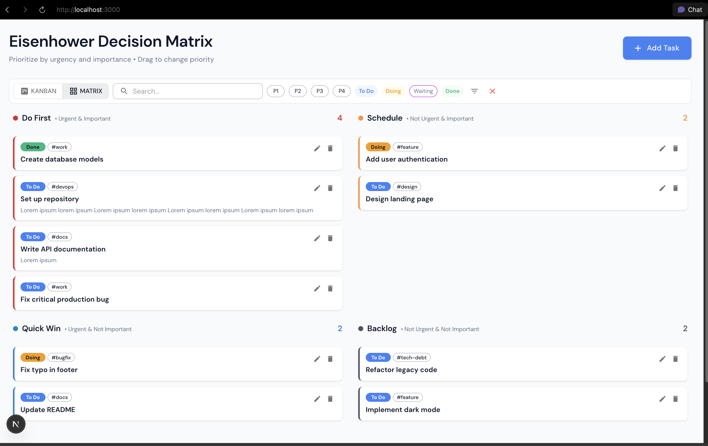
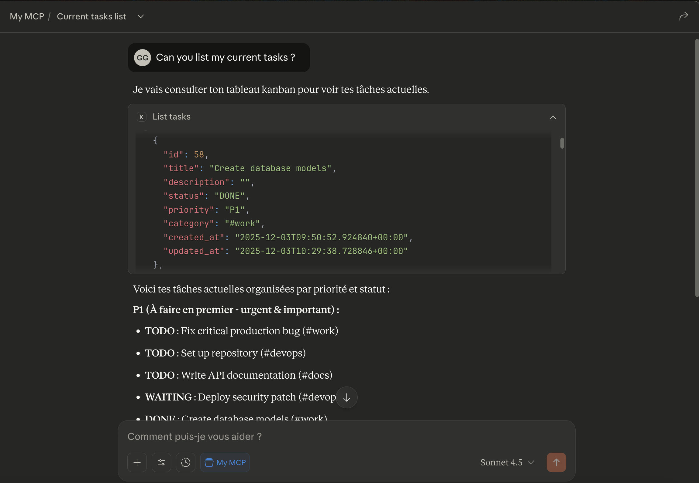
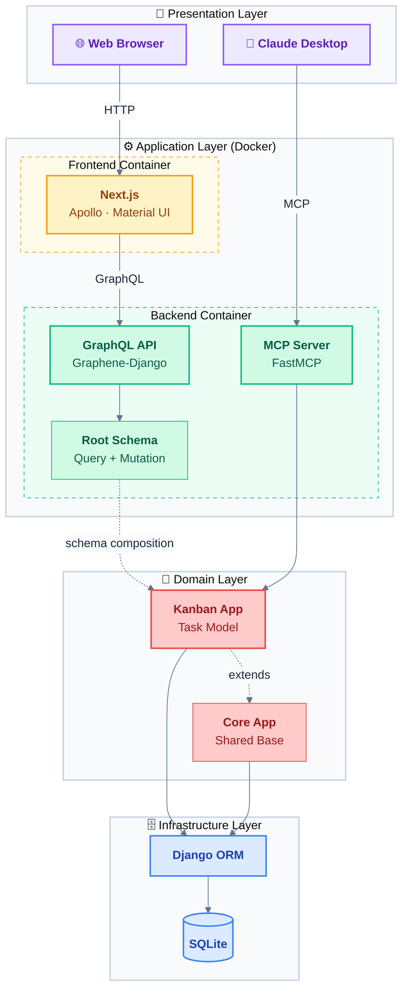
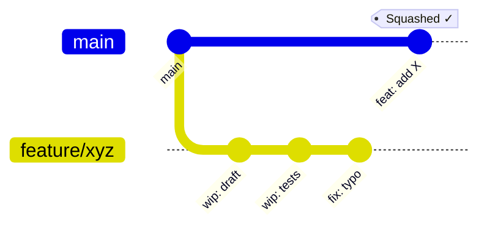
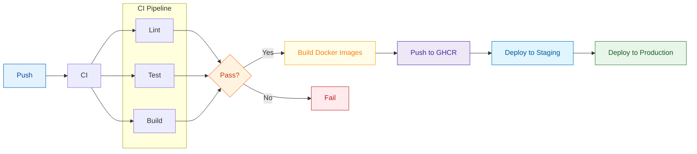

# Kanban MCP — Next.js · Django · GraphQL

A task management app featuring drag-and-drop Kanban boards, Eisenhower priority matrix, GraphQL API, and MCP server for Claude AI integration.

**Stack:** Next.js 15, Django 4.2, TypeScript, Material UI, Apollo Client, Graphene-Django

[](LICENSE)
[](https://www.python.org)
[](https://nodejs.org)
[](README.md)

> **Note:** This is a Proof of Concept / MVP project showcasing modern full-stack development. Built with assistance from Claude Code.

## Screenshots

<table>
  <tr>
    <td align="center"><strong>Kanban Board</strong></td>
    <td align="center"><strong>Eisenhower Matrix</strong></td>
  </tr>
  <tr>
    <td align="center"><a href="docs/screenshots/kanban.png"></a><br/><sub><a href="docs/screenshots/kanban.png">🔍 View full size</a></sub></td>
    <td align="center"><a href="docs/screenshots/matrix.png"></a><br/><sub><a href="docs/screenshots/matrix.png">🔍 View full size</a></sub></td>
  </tr>
  <tr>
    <td align="center" colspan="2"><strong>Claude Desktop (MCP Client)</strong></td>
  </tr>
  <tr>
    <td colspan="2" align="center"><a href="docs/screenshots/claude.png"></a><br/><sub><a href="docs/screenshots/claude.png">🔍 View full size</a></sub></td>
  </tr>
</table>

## Table of Contents

- [Kanban MCP — Next.js · Django · GraphQL](#kanban-mcp--nextjs--django--graphql)
  - [Screenshots](#screenshots)
  - [Table of Contents](#table-of-contents)
  - [1. Quick Start](#1-quick-start)
  - [2. Features](#2-features)
  - [3. Architecture](#3-architecture)
  - [4. Tech Stack](#4-tech-stack)
  - [5. Project Structure](#5-project-structure)
    - [Backend (Django)](#backend-django)
    - [Frontend (Next.js)](#frontend-nextjs)
    - [Root](#root)
  - [6. Development](#6-development)
  - [7. Testing](#7-testing)
  - [8. Pre-commit Hooks](#8-pre-commit-hooks)
  - [9. Git Workflow](#9-git-workflow)
  - [10. Continuous Integration \& Deployment](#10-continuous-integration--deployment)
  - [11. Deployment](#11-deployment)
  - [12. MCP Server Integration](#12-mcp-server-integration)
  - [13. License](#13-license)

## 1. Quick Start

```bash
# Recommended: Using Makefile
make setup      # First-time setup (creates .env, builds containers, runs migrations)
make up         # Start services

# Or with Docker directly
docker-compose up --build

# Or run services separately (without Docker)
cd backend && pip install -r requirements.txt && python manage.py migrate && python manage.py runserver
cd frontend && npm install && npm run dev
```

- Frontend: http://localhost:3000
- GraphQL API: http://localhost:8000/graphql

> **Windows**: Requires [WSL2](https://learn.microsoft.com/en-us/windows/wsl/install) or `choco install make` for Makefile commands

## 2. Features

Dual-view task management with Kanban board and Eisenhower Matrix, featuring drag-and-drop interface, priority-based workflows, and Claude AI integration via MCP server.

<details>
<summary><strong>📋 Task Management</strong></summary>

- Dual view modes: Kanban board + Eisenhower Matrix
- Priority system (P1-P4): Do First → Schedule → Quick Win → Backlog
- Status workflow: TODO → DOING → WAITING → DONE
- Category tagging with # prefix (#frontend, #backend, etc.)
- Drag-and-drop between columns and priority quadrants
- Task checklists with progress tracking
</details>

<details>
<summary><strong>🔍 Filtering & Search</strong></summary>

- Filter by priority (P1-P4) in both views
- Filter by status (To Do, Doing, Waiting, Done) in both views
- Filter by category with multi-select
- Full-text search across title, description, and category
</details>

<details>
<summary><strong>🤖 AI Integration</strong></summary>

- MCP (Model Context Protocol) server for Claude Desktop integration
- Natural language task management through Claude AI
- FastMCP-based implementation with GraphQL coordination
</details>

## 3. Architecture



**Layered architecture:** Presentation (clients) → Application (APIs) → Domain (business logic) → Infrastructure (data). Two interfaces to one backend: Browser via GraphQL with schema composition, Claude via MCP with direct model access.

## 4. Tech Stack

| Category | Technologies |
|----------|-------------|
| **Backend** |    |
| **Frontend** |    |
| **API Layer** |   |
| **Infrastructure** |   |
| **AI Integration** |  |
| **Dev Tools** |    |

## 5. Project Structure

### Backend (Django)

```
backend/
├── apps/
│   ├── core/                  # Shared base models (TimeStampedModel)
│   └── kanban/                # Kanban feature app
│       ├── models.py          # Task model
│       ├── schema/            # GraphQL layer
│       │   ├── types.py       # TaskType definition
│       │   ├── queries.py     # allTasks query
│       │   └── mutations.py   # create/update/delete
│       ├── tests/             # Model + API tests
│       └── management/        # seed_tasks command
├── config/                    # Project configuration
│   ├── settings.py            # Django settings
│   ├── urls.py                # URL routing (/graphql)
│   └── schema.py              # Root GraphQL schema
├── integrations/mcp/          # MCP server for Claude AI
├── scripts/                   # Utility scripts
└── tests/                     # Integration tests
```

### Frontend (Next.js)

```
frontend/src/
├── app/                       # Next.js App Router
├── components/
│   ├── common/                # Shared components
│   └── kanban/                # Kanban feature module
│       ├── Board.tsx          # Orchestrator
│       ├── KanbanColumn.tsx
│       ├── FilterBar.tsx
│       ├── EisenhowerMatrix.tsx
│       ├── types.ts           # Types + constants
│       ├── Task/              # Task components
│       ├── Checklist/         # Checklist components
│       └── hooks/             # Custom hooks
├── graphql/                   # Apollo Client layer
└── theme/                     # Material UI theme
```

### Root

```
├── docker-compose.yml         # Services orchestration
├── Makefile                   # Development shortcuts
└── .pre-commit-config.yaml    # Code quality hooks
```

## 6. Development

| Command | Description |
|---------|-------------|
| `make setup` | First-time project setup |
| `make up` / `make down` | Start/stop Docker services |
| `make test` | Run all tests (unit + integration + E2E) |
| `make lint` | Auto-fix linting issues |
| `make logs` / `make shell` | View logs / Django shell |

**GraphQL Playground**: http://localhost:8000/graphql — Query, create, update, delete tasks.

> **Windows**: Use [WSL2](https://learn.microsoft.com/en-us/windows/wsl/install) or `choco install make`

## 7. Testing

**Testing Trophy** approach — prioritizing integration tests for maximum confidence with minimal maintenance.

| **Layer** | **Tests** | **Tools** | **Description** |
|-----------|-----------|-----------|-----------------|
| 🎭 E2E | 1 | Playwright | Full user workflows through real browser automation |
| **🧪 Integration** | **37** | **Jest + RTL** | **Component behavior with React hooks, context, and APIs** |
| 🔬 Unit | 32 | Django | Individual functions and model logic isolation |
| 📏 Static | — | TypeScript, ESLint, Ruff | Type checking, linting, and code quality analysis |

```bash
make test       # Run all tests (unit + integration + e2e)
make check      # Full CI validation
```

## 8. Pre-commit Hooks

Automated code quality checks before each commit.

```bash
pip install pre-commit && pre-commit install   # Setup (one-time)
make precommit                                  # Run manually
make lint                                       # Auto-fix issues
```

## 9. Git Workflow

Feature branch workflow with **Squash Merge** for a clean, readable history.



**Why Squash Merge?** Multiple dev commits → 1 clean commit on main.

| Your branch | → | main |
|-------------|---|------|
| `wip: draft` | | |
| `wip: tests` | **Squash** | `feat: add feature X` |
| `fix: typo` | | *(1 commit = 1 feature)* |

**Workflow:**

| Step | Command | Purpose |
|------|---------|---------|
| 1. Branch | `git checkout -b feature/xyz` | Isolate work |
| 2. Commit | `git commit -m "wip: ..."` | Work freely |
| 3. Push | `git push -u origin feature/xyz` | Create PR |
| 4. CI | *Automatic* | Tests must pass |
| 5. Merge | **Squash and merge** | Clean history |

> **Result:** `main` shows one commit per feature — easy to read, review, and revert.

## 10. Continuous Integration & Deployment

Automated CI/CD pipeline with parallel execution, Docker containerization, and deployment simulation.



> **Two-Workflow Architecture:** `ci.yml` runs on every push (Lint → Test → Build → Docker validation). `deploy.yml` triggers automatically when CI passes on `main` branch (Build images → Push to GHCR → Staging → Production with manual approval).

**Pipeline Stages:**

| Stage | Jobs | Tools |
|-------|------|-------|
| **Lint** | Backend (Python) + Frontend (TypeScript) | Ruff, Black, isort, ESLint, Prettier |
| **Test** | Backend (Django) + Frontend (Jest) | pytest, Jest, React Testing Library |
| **Build** | Django checks + Next.js production build | django-admin, next build |
| **Docker** | Multi-stage builds (Backend + Frontend) | Docker Buildx, GHCR |
| **Deploy** | Smoke tests with docker-compose | Health checks, GraphQL validation |

**Features:**
- ✅ Parallel CI execution for fast feedback
- ✅ Docker containerization with GitHub Container Registry
- ✅ Automated smoke tests validate critical paths
- ✅ Fail-fast strategy with clear error reporting

See `.github/workflows/ci-cd.yml` for full configuration.

## 11. Deployment

**Deployment Features:**
- Automated CI/CD pipeline (`.github/workflows/`)
- Docker multi-stage builds with health checks
- Environment-based configuration (12-factor app)

**Deploy to:**
- **Cloud**: AWS ECS, GCP Cloud Run, Azure Container Instances
- **PaaS**: Vercel (frontend) + Render/Railway (backend)
- **Self-hosted**: Docker Compose with Nginx reverse proxy

```bash
# Production build
docker-compose -f docker-compose.prod.yml up --build
```

## 12. MCP Server Integration

[Model Context Protocol](https://modelcontextprotocol.io/) server for task management through Claude AI.

**Setup:** Configure Claude Desktop with `backend/integrations/mcp/server.py` path
**Operations:** List, create, update, delete tasks via natural language
**Deployment:** Supports stdio (local) and HTTP/SSE (remote) transport

**📚 API Documentation:** [GraphQL Playground](http://localhost:8000/graphql) | [Schema Reference](backend/kanban/graphql/schema.graphql)

See `backend/integrations/mcp/README.md` for configuration details.

## 13. License

MIT License
