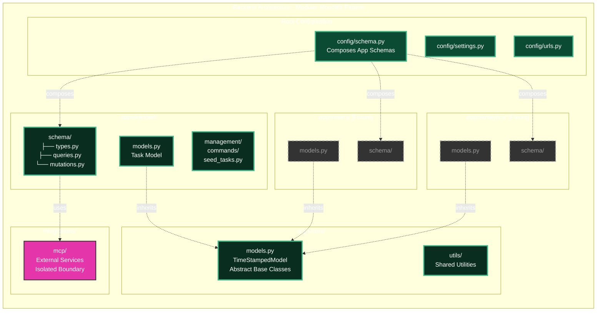

# Kanban Board - Next.js + Django GraphQL

Modern full-stack kanban board with drag-and-drop, built with Next.js 15, Django 4.2, and GraphQL.

## 🚀 Quick Start

### Docker (Recommended)

```bash
# Start everything
docker-compose up --build

# Or use Makefile shortcuts
make up              # Start services
make logs            # View logs
make test            # Run all tests
make down            # Stop services
```

**Access:**
- Frontend: http://localhost:3000
- GraphQL API: http://localhost:8000/graphql

### Local Development

**Backend:**
```bash
cd backend
pip install -r requirements.txt
python manage.py migrate
python manage.py runserver
```

**Frontend:**
```bash
cd frontend
npm install
npm run dev
```

## 🎯 Features

- ✅ Full CRUD operations (Create, Read, Update, Delete)
- ✅ Drag-and-drop between columns (TODO → DOING → DONE)
- ✅ GraphQL API with type-safe schema
- ✅ Real-time updates with Apollo Client
- ✅ Material UI responsive design
- ✅ TypeScript end-to-end
- ✅ Docker hot-reload for both services
- ✅ Pre-commit hooks (Ruff, ESLint, Prettier)
- ✅ Comprehensive test coverage

## 🏗️ Tech Stack

**Backend:**
- Django 4.2 + Graphene-Django
- GraphQL with split schema pattern
- SQLite (dev) / PostgreSQL (production)

**Frontend:**
- Next.js 15 (App Router)
- TypeScript + Apollo Client
- Material UI v7
- @dnd-kit for drag-and-drop

**Infrastructure:**
- Docker Compose with health checks
- Pre-commit hooks (Ruff + ESLint + Prettier)
- Hot reload for development
- Multi-stage builds for production

## 📁 Project Structure

```
.
├── backend/                         # Django backend (modular monolith)
│   ├── apps/                       # Django apps (OpenHEXA pattern)
│   │   ├── core/                   # Shared base models and utilities
│   │   │   ├── models.py           # TimeStampedModel (DRY principle)
│   │   │   └── apps.py             # Core app configuration
│   │   └── kanban/                 # Kanban feature app
│   │       ├── models.py           # Task model (inherits TimeStampedModel)
│   │       ├── apps.py             # Kanban app configuration
│   │       ├── schema/             # GraphQL split by concern
│   │       │   ├── types.py        # TaskType, TaskStatusEnum
│   │       │   ├── queries.py      # Query resolvers (allTasks)
│   │       │   └── mutations.py    # Mutation resolvers (CRUD)
│   │       ├── graphql/            # Exported GraphQL schema
│   │       │   └── schema.graphql  # For frontend consumption
│   │       ├── tests/              # App-specific tests
│   │       │   ├── test_models.py  # Model validation tests
│   │       │   └── test_schema.py  # GraphQL API tests
│   │       ├── management/         # Django management commands
│   │       │   └── commands/
│   │       │       └── seed_tasks.py  # Sample data generator
│   │       └── migrations/         # Database migrations
│   ├── config/                     # Django configuration
│   │   ├── settings.py             # Single settings file
│   │   ├── urls.py                 # URL routing
│   │   └── schema.py               # Root GraphQL schema (composition)
│   ├── integrations/               # External service integrations
│   │   └── mcp/                    # Model Context Protocol server
│   │       ├── server.py           # FastMCP implementation
│   │       ├── fastmcp.json        # Server configuration
│   │       ├── mcp_config.example.json  # Claude Desktop config template
│   │       └── README.md           # MCP setup instructions
│   ├── scripts/                    # Utility scripts
│   │   ├── export_schema.py        # GraphQL schema export
│   │   └── README.md               # Scripts documentation
│   ├── tests/                      # Project-wide integration tests
│   │   ├── integration/
│   │   │   └── test_mcp_server.py  # MCP server async tests
│   │   └── conftest.py             # Pytest configuration
│   ├── data/                       # SQLite database directory
│   │   └── db.sqlite3
│   ├── requirements.txt            # Python dependencies
│   ├── Dockerfile                  # Multi-stage Docker build
│   └── manage.py                   # Django management script
│
├── frontend/                       # Next.js frontend
│   ├── src/
│   │   ├── app/                    # Next.js App Router
│   │   │   ├── layout.tsx          # Root layout
│   │   │   ├── page.tsx            # Home page (redirects to /tasks)
│   │   │   ├── providers.tsx       # App providers (Theme, Apollo)
│   │   │   └── tasks/
│   │   │       └── page.tsx        # Kanban board page
│   │   ├── components/             # React components
│   │   │   ├── Board.tsx           # Main board orchestrator
│   │   │   ├── ApolloWrapper.tsx   # Apollo Client provider
│   │   │   └── kanban/             # Kanban-specific components
│   │   │       ├── types.ts        # TypeScript types
│   │   │       ├── TaskCard.tsx    # Draggable task card
│   │   │       ├── KanbanColumn.tsx  # Column with drop zone
│   │   │       ├── TaskDialog.tsx  # Create/edit dialog
│   │   │       └── useTaskDialog.ts  # Dialog state hook
│   │   ├── graphql/                # GraphQL operations
│   │   │   ├── client.ts           # Apollo Client config
│   │   │   ├── queries.ts          # GET_TASKS query
│   │   │   └── mutations.ts        # CREATE/UPDATE/DELETE mutations
│   │   ├── theme/                  # Material UI theme
│   │   │   └── theme.ts            # Custom theme configuration
│   │   └── __tests__/              # Frontend tests
│   ├── package.json                # Node dependencies
│   ├── next.config.ts              # Next.js configuration
│   ├── Dockerfile                  # Multi-stage Docker build
│   └── tsconfig.json               # TypeScript configuration
│
├── docker-compose.yml              # Services orchestration
├── Makefile                        # Development shortcuts
├── .pre-commit-config.yaml         # Code quality hooks (Ruff, ESLint)
└── .env                            # Environment variables (ports, URLs)
```

## 🧪 Testing

```bash
# All tests
make test

# Backend only (Django) - Run in Docker
docker-compose exec backend python manage.py test apps.kanban.tests

# Or run all backend tests including integration
docker-compose exec backend python manage.py test

# Frontend only (Jest)
cd frontend
npm test
```

**Test Coverage:**
- Backend: 20 tests (models + GraphQL API)
  - `apps/kanban/tests/test_models.py` - Task model validation
  - `apps/kanban/tests/test_schema.py` - GraphQL API operations
  - `tests/integration/test_mcp_server.py` - MCP server async functions
- Frontend: 12 tests (components + integration)
- Focus: Critical paths + enum validation + async wrappers

## 🔧 Pre-commit Hooks

Install and use code quality hooks:

```bash
# Install
pip install pre-commit
pre-commit install

# Run manually
pre-commit run --all-files

# Bypass for emergency
git commit --no-verify
```

**What's checked:**
- Python: Ruff (linting + formatting)
- TypeScript: ESLint + Prettier + type checking
- General: Trailing whitespace, YAML validation, large files

## 📊 Development Commands

### Makefile Shortcuts

```bash
make up              # Start services
make down            # Stop services
make test            # Run all tests
make migrate         # Run migrations
make clean           # Remove containers/volumes
make logs            # View logs
make shell           # Django shell
make lint            # Lint and format code
make hooks-install   # Install pre-commit hooks
```

### GraphQL Operations

```graphql
# Query tasks
query { allTasks { id title status createdAt } }

# Create task
mutation { createTask(title: "New Task", status: TODO) { task { id } } }

# Update task (drag-and-drop)
mutation { updateTask(id: "1", status: DOING) { task { id status } } }

# Delete task
mutation { deleteTask(id: "1") { success } }
```

## 🎨 Architecture Highlights

### System Architecture

The following diagram illustrates the complete system architecture, showing how the Next.js frontend communicates with the Django backend through a GraphQL API layer, and how the modular backend structure enables scalability.

```mermaid
graph TB
    subgraph "Frontend Layer"
        UI[Next.js 15 App]
        Apollo[Apollo Client]
        DnD[@dnd-kit]
        MUI[Material UI v7]

        UI --> Apollo
        UI --> DnD
        UI --> MUI
    end

    subgraph "API Layer"
        GraphQL[GraphQL API<br/>Graphene-Django]
        Schema[Schema Composition<br/>Root ← Apps]
    end

    subgraph "Backend Layer - Modular Monolith"
        subgraph "Core App"
            CoreModels[TimeStampedModel<br/>Shared Base Classes]
        end

        subgraph "Kanban App"
            KanbanSchema[GraphQL Schema<br/>types | queries | mutations]
            KanbanModels[Task Model]
            KanbanLogic[Business Logic]
        end

        subgraph "Integration Layer"
            MCP[MCP Server<br/>External Integrations]
        end

        ORM[Django ORM]
    end

    subgraph "Data Layer"
        DB[(SQLite Dev<br/>PostgreSQL Prod)]
    end

    subgraph "Infrastructure"
        Docker[Docker Compose<br/>Hot Reload]
    end

    %% Data Flow
    Apollo -->|GraphQL Queries/Mutations| GraphQL
    GraphQL --> Schema
    Schema -.inherits.-> KanbanSchema
    KanbanSchema --> KanbanLogic
    KanbanLogic --> KanbanModels
    KanbanModels -.extends.-> CoreModels
    KanbanModels --> ORM
    ORM --> DB

    %% Integration Flow
    KanbanLogic -.uses.-> MCP

    %% Infrastructure
    Docker -.orchestrates.-> UI
    Docker -.orchestrates.-> GraphQL
    Docker -.orchestrates.-> DB

    %% Styling
    classDef frontend fill:#61dafb,stroke:#333,stroke-width:2px,color:#000
    classDef api fill:#e535ab,stroke:#333,stroke-width:2px,color:#fff
    classDef backend fill:#092e20,stroke:#333,stroke-width:2px,color:#fff
    classDef data fill:#336791,stroke:#333,stroke-width:2px,color:#fff
    classDef infra fill:#2496ed,stroke:#333,stroke-width:2px,color:#fff

    class UI,Apollo,DnD,MUI frontend
    class GraphQL,Schema api
    class CoreModels,KanbanSchema,KanbanModels,KanbanLogic,MCP,ORM backend
    class DB data
    class Docker infra
```

**Key Architectural Highlights**:
- **Type-Safe Communication**: GraphQL schema ensures frontend-backend contract
- **Schema Composition**: Root schema inherits from feature-specific app schemas
- **Clean Separation**: Integration layer (MCP) isolated from core business logic
- **Infrastructure Automation**: Docker Compose orchestrates services with hot-reload

### Backend Module Organization

This project follows the **OpenHEXA architectural pattern** used at Bluesquare, enabling easy feature addition without modifying existing code. Each Django app is self-contained with its own models, schemas, and business logic.



**Scalability Benefits**:
- ✅ **Add New Features**: Create new app → Add schemas → Compose in root (zero changes to existing apps)
- ✅ **Team Collaboration**: Clear ownership boundaries for parallel development
- ✅ **Maintainability**: Changes isolated to specific apps, reducing regression risk
- ✅ **Testability**: Apps can be tested independently with clear boundaries

**Example - Adding a "users" app**:
```python
# config/schema.py
import kanban.schema
import users.schema  # New app

class Query(kanban.schema.Query, users.schema.Query, graphene.ObjectType):
    pass  # Automatic composition, no logic changes needed
```

### Backend: Modular Monolith (OpenHEXA Pattern)
**Inspired by [Bluesquare's OpenHEXA](https://github.com/BLSQ/openhexa)** - modular Django architecture for maintainability at scale

**Key Patterns:**
- **Feature-Based Apps** (`apps/kanban/`, `apps/core/`) - Clear boundaries for team collaboration
- **Split GraphQL Schemas** - Separate files for types, queries, mutations (easier to navigate)
- **DRY Base Models** (`apps/core/models.py`) - Shared `TimeStampedModel` prevents duplication
- **Organized Integrations** (`integrations/mcp/`) - External services isolated from core apps
- **Schema Composition** (`config/schema.py`) - Root schema inherits from app schemas
- **Easy Scaling** - Add new apps (users, analytics) without touching existing code

**Why This Matters:**
- ✅ Multiple devs can work on different apps simultaneously
- ✅ Changes in one app don't affect others (low coupling)
- ✅ Easy to add features without creating technical debt
- ✅ Clear ownership and testing boundaries

### Frontend: SOLID Principles
- **Single Responsibility** - Each component does one thing well
- **Custom Hooks** - Reusable state management (`useTaskDialog`)
- **Type Safety** - TypeScript enums (`TaskStatus`) prevent runtime errors
- **Component Isolation** - `kanban/` directory groups related components
- **Separation of Concerns** - GraphQL, theme, and components in separate directories

## 🤖 AI Agent Integration (MCP Server)

**Bonus Feature**: [Model Context Protocol](https://modelcontextprotocol.io/) server that lets Claude AI manage tasks through natural language—*"Create a task for code review"* or *"Move task 3 to done"*.

**Technical Highlights:**

- **Async/Sync Bridge**: `@sync_to_async` wrappers connect Django's ORM to MCP's async protocol
- **Dual Transport**: Single codebase supports stdio (local) and HTTP/SSE (remote/mobile)
- **Type-Safe Tools**: Python type hints auto-generate JSON schemas for Claude
- **Modular Design**: Isolated in `integrations/mcp/` following clean architecture

### Try It Locally

```bash
# 1. Install dependencies
cd backend && python3.12 -m venv venv && source venv/bin/activate
pip install -r requirements.txt

# 2. Configure Claude Desktop (~/Library/Application Support/Claude/claude_desktop_config.json)
{
  "mcpServers": {
    "kanban": {
      "command": "/FULL/PATH/TO/backend/venv/bin/python",
      "args": ["/FULL/PATH/TO/backend/integrations/mcp/server.py"],
      "env": {"DJANGO_SETTINGS_MODULE": "config.settings"}
    }
  }
}

# 3. Restart Claude Desktop and try: "Show me all TODO tasks"
```

**Available commands**: list tasks, create task, update status, delete task

> **For deployment**: Server supports Railway/Render with HTTP/SSE transport for Claude Mobile. See `backend/integrations/mcp/README.md` for production setup

## 📄 License

MIT License - See LICENSE file for details

---

**Built with:** Next.js 15, Django 4.2, GraphQL, TypeScript, Docker
