# Kanban MCP — Next.js · Django · GraphQL

A modern task management app featuring drag-and-drop Kanban boards, Eisenhower priority matrix, GraphQL API, and an MCP server for seamless Claude AI integration.

**Stack:** Next.js 15, Django 4.2, TypeScript, Material UI, Apollo Client, Graphene-Django

## Screenshots

<table>
  <tr>
    <td align="center"><strong>Kanban Board</strong></td>
    <td align="center"><strong>Eisenhower Matrix</strong></td>
  </tr>
  <tr>
    <td align="center"><a href="docs/screenshots/kanban.png"></a><br/><sub><a href="docs/screenshots/kanban.png">🔍 View full size</a></sub></td>
    <td align="center"><a href="docs/screenshots/eisenhower.png"></a><br/><sub><a href="docs/screenshots/eisenhower.png">🔍 View full size</a></sub></td>
  </tr>
  <tr>
    <td align="center" colspan="2"><strong>Claude Desktop (MCP Client)</strong></td>
  </tr>
  <tr>
    <td colspan="2" align="center"><a href="docs/screenshots/claude.png"></a><br/><sub><a href="docs/screenshots/claude.png">🔍 View full size</a></sub></td>
  </tr>
</table>

## Table of Contents

1. [Quick Start](#1-quick-start)
2. [Features](#2-features)
3. [Tech Stack](#3-tech-stack)
4. [Project Structure](#4-project-structure)
5. [Testing](#5-testing)
6. [Pre-commit Hooks](#6-pre-commit-hooks)
7. [Continuous Integration](#7-continuous-integration)
8. [Development Commands](#8-development-commands)
9. [Deployment](#9-deployment)
10. [Architecture](#10-architecture)
11. [MCP Server Integration](#11-mcp-server-integration)
12. [License](#12-license)

## 1. Quick Start

```bash
# With Docker
docker-compose up --build

# Or separately
cd backend && pip install -r requirements.txt && python manage.py migrate && python manage.py runserver
cd frontend && npm install && npm run dev
```

- Frontend: http://localhost:3000
- GraphQL API: http://localhost:8000/graphql

## 2. Features

**Task Management:**
- Dual view modes: Kanban board + Eisenhower Matrix
- Priority system (P1-P4): Do First → Schedule → Quick Win → Backlog
- Status workflow: TODO → DOING → WAITING → DONE
- Category tagging with # prefix (#frontend, #backend, etc.)
- Drag-and-drop between columns and priority quadrants

**Filtering & Search:**
- Filter by priority (P1-P4) in both views
- Filter by status (To Do, Doing, Waiting, Done) in both views
- Filter by category with multi-select
- Full-text search across title, description, and category

**Technical Stack:**
- GraphQL API with type-safe Apollo Client
- TypeScript end-to-end with Material UI
- Docker development environment with hot-reload
- Pre-commit hooks (Ruff, ESLint, Prettier)
- MCP server for Claude AI integration

## 3. Tech Stack

**Backend:** Django 4.2, Graphene-Django, SQLite  
**Frontend:** Next.js 15, TypeScript, Apollo Client, Material UI v7, @dnd-kit  
**Infrastructure:** Docker Compose, pre-commit hooks (Ruff, ESLint, Prettier)

## 4. Project Structure

### Backend (Django)

```
backend/
├── apps/
│   ├── core/                  # Shared base models (TimeStampedModel)
│   └── kanban/                # Kanban feature app
│       ├── models.py          # Task model
│       ├── schema/            # GraphQL layer
│       │   ├── types.py       # TaskType definition
│       │   ├── queries.py     # allTasks query
│       │   └── mutations.py   # create/update/delete
│       ├── tests/             # Model + API tests
│       └── management/        # seed_tasks command
├── config/                    # Project configuration
│   ├── settings.py            # Django settings
│   ├── urls.py                # URL routing (/graphql)
│   └── schema.py              # Root GraphQL schema
├── integrations/mcp/          # MCP server for Claude AI
├── scripts/                   # Utility scripts
└── tests/                     # Integration tests
```

### Frontend (Next.js)

```
frontend/src/
├── app/                       # Next.js App Router (layout, pages)
├── components/
│   ├── ApolloWrapper.tsx      # Apollo Client provider
│   └── kanban/                # Kanban feature module
│       ├── Board.tsx          # Main orchestrator
│       ├── KanbanColumn.tsx   # Column layout
│       ├── FilterBar.tsx      # Filters + view toggle
│       ├── EisenhowerMatrix.tsx
│       ├── useTaskDialog.ts   # Dialog state hook
│       ├── types.ts           # Types + constants
│       ├── index.ts           # Barrel exports
│       └── Task/              # Task components
│           ├── TaskCard.tsx
│           └── TaskDialog.tsx
├── graphql/                   # Apollo Client layer
│   ├── client.ts              # Apollo Client setup
│   ├── queries.ts             # GET_TASKS query
│   └── mutations.ts           # CREATE/UPDATE/DELETE
└── theme/                     # Material UI theme
```

### Root

```
├── docker-compose.yml         # Services orchestration
├── Makefile                   # Development shortcuts
└── .pre-commit-config.yaml    # Code quality hooks
```

## 5. Testing

### Quick Test Commands

```bash
# All checks (recommended before pushing)
./scripts/check-ci.sh

# Individual components
make test                                      # All tests via Docker
docker-compose exec backend python manage.py test  # Backend only
cd frontend && npm test                        # Frontend only
```

### Run CI Checks Locally

**Before pushing to GitHub**, verify all CI checks will pass:

```bash
# Automated check (runs all CI validations)
./scripts/check-ci.sh

# Manual checks
cd backend
source venv/bin/activate
ruff check .                    # Linting
ruff format --check .           # Format check
python manage.py test           # Tests

cd ../frontend
npm run lint                    # ESLint
npx tsc --noEmit               # TypeScript
npm test                        # Jest

# Docker validation
docker-compose config          # Validate docker-compose.yml
```

### Backend Tests (20 tests)
- Model tests: Task creation, status transitions, timestamp behavior
- GraphQL API tests: Queries, mutations, error handling
- Coverage: 85%+

### Frontend Tests (13+ tests)
- Component tests: KanbanColumn, TaskCard, TaskDialog
- Integration tests: Drag-and-drop, filters, view switching
- Coverage: 80%+

**Coverage Reports:**
```bash
# Backend coverage
cd backend && coverage run --source='.' manage.py test && coverage report

# Frontend coverage
cd frontend && npm test -- --coverage
```

## 6. Pre-commit Hooks

```bash
pip install pre-commit && pre-commit install
pre-commit run --all-files  # Manual run
```

Checks: Ruff (Python), ESLint + Prettier (TypeScript), YAML validation

## 7. Continuous Integration & Deployment

Automated quality gates ensure code quality and deployment safety through parallel validation and staged deployment.

```mermaid
graph LR
    A[💾 Commit] --> B[🔍 CI Pipeline]
    B --> C{Quality Gates}
    C -->|Lint| D[✓ Backend Ruff]
    C -->|Lint| E[✓ Frontend ESLint]
    C -->|Test| F[✓ Django Tests]
    C -->|Test| G[✓ Jest Tests]
    C -->|Build| H[✓ Docker Images]
    D --> I[🏗️ Build Artifacts]
    E --> I
    F --> I
    G --> I
    H --> I
    I --> J[🚀 Deploy Staging]
    J --> K[👤 Manual Approval]
    K --> L[🌐 Production]

    style A fill:#e1f5ff,stroke:#01579b
    style B fill:#fff9c4,stroke:#f57f17
    style C fill:#fff3e0,stroke:#e65100
    style I fill:#e8f5e9,stroke:#2e7d32
    style J fill:#f3e5f5,stroke:#4a148c
    style L fill:#c8e6c9,stroke:#1b5e20
```



**Quality Validations:** Backend/Frontend linting, unit tests, TypeScript checks, Docker builds
**Deployment:** Staging auto-deploy → Manual production approval with health checks

**Run CI checks locally:**
```bash
./scripts/check-ci.sh  # Validates all quality gates before pushing
```

## 8. Development Commands

```bash
make up/down         # Start/stop services
make test/migrate    # Run tests/migrations
make logs/shell      # View logs/Django shell
```

**GraphQL API** (http://localhost:8000/graphql):
- Query: `allTasks { id title status priority category }`
- Create: `createTask(title: "Task", status: TODO, priority: P1)`
- Update: `updateTask(id: "1", status: DOING)`
- Delete: `deleteTask(id: "1")`

## 9. Deployment

**Production-Ready Features:**
- Automated CI/CD pipeline (`.github/workflows/`)
- Docker multi-stage builds with health checks
- Environment-based configuration (12-factor app)

**Deploy to:**
- **Cloud**: AWS ECS, GCP Cloud Run, Azure Container Instances
- **PaaS**: Vercel (frontend) + Render/Railway (backend)
- **Self-hosted**: Docker Compose with Nginx reverse proxy

```bash
# Production build
docker-compose -f docker-compose.prod.yml up --build
```

## 10. Architecture

```mermaid
%%{init: {'theme': 'base', 'themeVariables': { 'primaryColor': '#fff', 'primaryTextColor': '#1e293b', 'primaryBorderColor': '#e2e8f0', 'lineColor': '#64748b', 'secondaryColor': '#f8fafc', 'tertiaryColor': '#f1f5f9'}}}%%
graph TB
    subgraph Presentation["🎨 Presentation Layer"]
        Browser["🌐 <b>Web Browser</b><br/><i>HTTP Client</i>"]
        Claude["🤖 <b>Claude Desktop</b><br/><i>MCP Client</i>"]
    end

    subgraph Application["⚙️ Application Layer (Docker)"]
        subgraph Frontend["Frontend Container"]
            NextApp["<b>Next.js 15 App</b><br/>App Router · SSR"]
            Apollo["<b>Apollo Client</b><br/>GraphQL Cache · State"]
            UI["<b>UI Components</b><br/>Material UI v7 · dnd-kit"]
        end

        subgraph Backend["Backend Container"]
            subgraph APIs["API Interfaces"]
                GraphQL["<b>GraphQL Endpoint</b><br/><i>/graphql</i><br/>Graphene-Django"]
                MCPServer["<b>MCP Server</b><br/><i>stdio/HTTP+SSE</i><br/>FastMCP"]
            end

            subgraph Schema["Schema Layer"]
                RootSchema["<b>Root Schema</b><br/><i>config/schema.py</i><br/>Query + Mutation"]
                KanbanSchema["<b>Kanban Schema</b><br/><i>apps/kanban/schema/</i><br/>types · queries · mutations"]
            end
        end
    end

    subgraph Domain["🧩 Domain Layer"]
        subgraph Apps["Django Apps (Modular Monolith)"]
            CoreApp["<b>Core App</b><br/>TimeStampedModel<br/>Shared abstractions"]
            KanbanApp["<b>Kanban App</b><br/>Task Model<br/>Business logic"]
        end
    end

    subgraph Infrastructure["🗄️ Infrastructure Layer"]
        ORM["<b>Django ORM</b><br/>QuerySet API · Migrations"]
        DB[("<b>SQLite</b><br/>db.sqlite3")]
    end

    %% Client to Frontend
    Browser -->|"HTTP/HTTPS<br/>React hydration"| NextApp
    NextApp --> Apollo
    Apollo --> UI

    %% Frontend to Backend
    Apollo -->|"GraphQL queries<br/>mutations over HTTP"| GraphQL

    %% Claude to Backend
    Claude -->|"MCP protocol<br/>stdio/HTTP+SSE"| MCPServer

    %% Schema Composition
    GraphQL --> RootSchema
    RootSchema -.->|"inherits from"| KanbanSchema
    MCPServer -.->|"direct import"| KanbanApp

    %% Backend to Domain
    KanbanSchema --> KanbanApp
    KanbanApp -.->|"extends"| CoreApp

    %% Domain to Infrastructure
    KanbanApp --> ORM
    CoreApp --> ORM
    ORM -->|"SQL queries"| DB

    %% Styling
    style Browser fill:#ede9fe,stroke:#8b5cf6,color:#5b21b6,stroke-width:2px
    style Claude fill:#ede9fe,stroke:#8b5cf6,color:#5b21b6,stroke-width:2px
    style NextApp fill:#fef3c7,stroke:#f59e0b,color:#92400e,stroke-width:2px
    style Apollo fill:#fef3c7,stroke:#f59e0b,color:#92400e
    style UI fill:#fef3c7,stroke:#f59e0b,color:#92400e
    style GraphQL fill:#d1fae5,stroke:#10b981,color:#065f46,stroke-width:2px
    style MCPServer fill:#d1fae5,stroke:#10b981,color:#065f46,stroke-width:2px
    style RootSchema fill:#d1fae5,stroke:#10b981,color:#065f46
    style KanbanSchema fill:#d1fae5,stroke:#10b981,color:#065f46
    style CoreApp fill:#fecaca,stroke:#ef4444,color:#991b1b
    style KanbanApp fill:#fecaca,stroke:#ef4444,color:#991b1b,stroke-width:2px
    style ORM fill:#dbeafe,stroke:#3b82f6,color:#1e40af,stroke-width:2px
    style DB fill:#dbeafe,stroke:#3b82f6,color:#1e40af,stroke-width:2px

    %% Container styling
    style Presentation fill:#f8fafc,stroke:#cbd5e1,stroke-width:2px
    style Application fill:#f8fafc,stroke:#cbd5e1,stroke-width:2px
    style Frontend fill:#fffbeb,stroke:#fbbf24,stroke-width:1px,stroke-dasharray: 5 5
    style Backend fill:#ecfdf5,stroke:#34d399,stroke-width:1px,stroke-dasharray: 5 5
    style APIs fill:#f0fdf4,stroke:#22c55e,stroke-width:1px
    style Schema fill:#f0fdf4,stroke:#22c55e,stroke-width:1px
    style Domain fill:#f8fafc,stroke:#cbd5e1,stroke-width:2px
    style Apps fill:#fef2f2,stroke:#f87171,stroke-width:1px,stroke-dasharray: 5 5
    style Infrastructure fill:#f8fafc,stroke:#cbd5e1,stroke-width:2px
```



**Layered architecture:** Presentation (clients) → Application (APIs) → Domain (business logic) → Infrastructure (data). Two interfaces to one backend: Browser via GraphQL with schema composition, Claude via MCP with direct model access.

## 11. MCP Server Integration

[Model Context Protocol](https://modelcontextprotocol.io/) server for task management through Claude AI.

**Setup:** Configure Claude Desktop with `backend/integrations/mcp/server.py` path  
**Operations:** List, create, update, delete tasks via natural language  
**Deployment:** Supports stdio (local) and HTTP/SSE (remote) transport

See `backend/integrations/mcp/README.md` for configuration details.

## 12. License

MIT License
